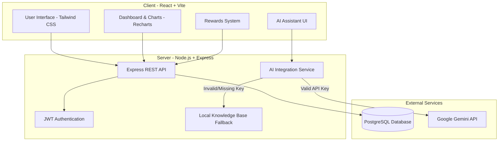

# PowerSaver AI - Energy Saving Platform 🌍⚡

## ⚠️ Problem Statement
Energy consumption on college campuses and in student dormitories is often excessively high due to a lack of awareness, motivation, and direct accountability. Students often leave high-draw appliances plugged in, lights on, and temperature controls unoptimized because they don't directly see the financial or environmental impact of their daily habits. There is a need for a platform that not only tracks usage but proactively guides and incentivizes students to build sustainable habits.

## 💡 Solution
**PowerSaver** is a modern, AI-powered, and gamified web application built to solve campus energy waste. It provides:
1. **Live Energy Tracking:** A real-time dashboard visualizing daily and weekly power usage.
2. **AI Energy Assistant:** An intelligent Chatbot powered by Google Gemini (with a robust offline local fallback) that provides tailored, actionable recommendations on how to reduce energy waste based on user context.
3. **Gamification & Rewards:** Students earn points for logging readings, hitting reduction goals, and maintaining energy-saving streaks, which can be redeemed for campus coupons.
4. **Community Leaderboards:** A competitive ranking system to foster a sense of community responsibility.
5. **Impact Reporting:** Downloadable PDF reports highlighting carbon offset and trees saved.

## 🏗️ Architecture Diagram
Below is the high-level architecture diagram of the PowerSaver platform.



## 💻 Tech Stack
- **Frontend:** React, Vite, Tailwind CSS, Framer Motion, Recharts, Lucide React
- **Backend:** Node.js, Express.js, PostgreSQL (pg module), JSON Web Tokens (JWT)
- **AI Integration:** Google Generative AI (`@google/generative-ai`)

## 🚀 Prompts & Commands Used
### 📝 Original Project Prompt
> Build a full-stack, working website for PowerSaver AI — a gamified energy-saving platform for college students. Stack: React.js (frontend), Node.js/Express (backend API), PostgreSQL (database), plus an AI recommendation engine (calls an LLM API for personalized tips). Light theme, clean and modern, mobile-responsive.

#### Core User Flow
- Student signs up / logs in
- Their power usage streams into a dashboard in real time
- AI engine analyzes usage patterns and generates personalized saving tips
- Student earns coins for hitting savings milestones and maintaining daily streaks
- Coins and streaks are ranked on a live leaderboard against other students/dorms

#### Pages & Functionality
**1. Landing Page**
- Hero section: headline, subheadline, CTA buttons (Sign up / Log in)
- Animated impact counter (total kWh saved across all users)
- "How it works" — 3-step explainer with icons
- Testimonial/social proof section & Footer with links

**2. Auth (Sign up / Log in)**
- Email + password auth (bcrypt hashing, JWT sessions)
- Fields at signup: name, email, password, college/dorm (for leaderboard grouping)
- Protected routes redirect unauthenticated users to login

**3. Dashboard (Main App)**
- Real-time power usage chart (line/area chart, last 24h and last 7 days toggle)
- Current streak counter with flame icon, animates on increment
- Coin balance, prominently displayed in navbar
- "Today's AI recommendation" card — pulls from the AI engine, refreshes daily
- Quick-glance stats: this week's savings vs last week, rank change

**4. Leaderboard**
- Tabs: Individual / By dorm-college
- Ranked list: avatar, name, coin total, streak badge
- Current user's row highlighted and auto-scrolled into view
- Filter by time period: this week / this month / all-time

**5. Rewards / Milestones**
- Grid of milestone cards (e.g. "Save 10 kWh this week", "7-day streak")
- Progress bar per milestone, coin value shown
- Locked vs unlocked celebratory states
- Claim animation when a milestone is completed

**6. AI Recommendations Panel**
- List of personalized tips with descriptions, estimated savings, and a "mark as done" action
- Tips generated server-side by calling an LLM with the user's recent usage data

**7. Profile / Settings**
- Edit name, dorm/college, avatar & Notification preferences
- Logout

#### Data Model & API Endpoints
**Database Tables:**
- `users`: id, name, email, password_hash, dorm, coins, current_streak, longest_streak, created_at
- `usage_readings`: id, user_id, kwh, timestamp
- `milestones`: id, title, description, target_type, target_value, coin_reward
- `user_milestones`: id, user_id, milestone_id, progress, completed_at
- `recommendations`: id, user_id, text, estimated_savings_kwh, status, created_at
- `leaderboard_cache`: id, period, entries (JSON), updated_at

**Express Routes:**
- `POST /api/auth/signup` & `POST /api/auth/login`
- `GET /api/users/me`
- `GET /api/usage/:userId?range=24h|7d`
- `POST /api/usage/ingest`
- `GET /api/leaderboard?period=week|month|all`
- `GET /api/milestones/:userId`
- `GET /api/recommendations/:userId` & `POST /api/recommendations/generate`
- `POST /api/streaks/checkin`

#### Gamification & AI Engine
- **Streaks:** Increment `current_streak` if usage is below average; reset to 0 on a missed day.
- **Coins:** Awarded on milestone completion and streak checkpoints.
- **Leaderboard:** Recompute ranks on a schedule via cron job.
- **AI Engine:** Backend service sends the last 7 days of usage + dorm context to an LLM, prompting for 1-3 concrete tips in JSON format.

#### Design System & Tech Specs
- **Theme:** Soft off-white background, white cards with subtle shadows. Primary Green for eco-actions, Accent Amber for coins/streaks. Clean sans-serif typography.
- **Micro-animations:** Coin reveal on claims, flame pulse on streaks, number count-up.
- **Stack:** React, Tailwind CSS, Recharts, Node.js + Express, PostgreSQL, JWT auth. Deploy-ready via env variables.
### Initialization & Setup
```bash
# Frontend Setup
npm create vite@latest client -- --template react
cd client
npm install
npm install tailwindcss @tailwindcss/postcss postcss lucide-react recharts framer-motion react-router-dom

# Backend Setup
mkdir server
cd server
npm init -y
npm install express cors dotenv pg jsonwebtoken @google/generative-ai
```

### Running the Application
**Backend Terminal:**
```bash
cd server
npm start
```
**Frontend Terminal:**
```bash
cd client
npm run dev
```

### Key AI Prompts & Implementations
During the development of the AI Assistant, the following system logic was implemented to handle context:

**1. Contextual AI Generation Prompt (Backend):**
```javascript
const prompt = `You are a helpful and enthusiastic energy-saving assistant for a student living in a dorm. 
Their recent energy usage data is: ${JSON.stringify(recentUsage)}. 
Please provide 2 brief, actionable tips to reduce their energy consumption today. 
Format the response as a JSON array...`
```

**2. Smart NLP Fallback (Handling API Key Issues):**
To ensure the application remains fully functional even without a valid Google AI Studio API key, a local keyword-matching algorithm was implemented in `aiService.js`. 
If the AI API returns an error (e.g., when an OAuth token is passed instead of an API Key), the system automatically defaults to scanning the user's prompt for keywords like `ac`, `heat`, `laundry`, `lights`, and `charger` to provide accurate, context-aware offline responses without crashing the server or displaying generic errors.
# power-saver

